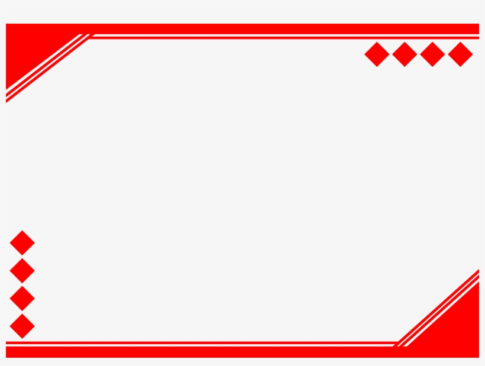

# Best Weather App

[](https://choosealicense.com/licenses/apache-2.0/)
[](https://choosealicense.com/licenses/mit/)


## Description
- What was your motivation?
I wanted to learn about weather patterns

- Why did you build this project?
I built it to gather data from different weather APIs and consolidate it in one app

- What problem does it solve?
Allows a user to view weather data from many different sources

- What did you learn?
I learned to make API calls and how to sync them

## Table of Contents
- [Installation](#installation)
- [Usage](#usage)
- [Credits](#credits)
- [License](#license)
- [Badges](#badges)
- [Features](#features)
- [Contribute](#contribute)
- [Tests](#tests)
- [Questions](#questions)
  
## Installation

1. Clone the project
2. Install NodeJS
  
## Usage
node index.js

## Screenshots

```md

```
```md

```

## Credits

### Collaborators
- John Smith <github.com/js>
- Joe Smith <github.com/jss

## Third-Party

- Bulma
- NodeJS
- Apache

### Tutorials
- www.tutorial.com/1
- www.tutorial.com/2

## License
This application is covered under the following license(s).


### Apache License 2.0
[](https://choosealicense.com/licenses/apache-2.0/)

### MIT License
[](https://choosealicense.com/licenses/mit/)

## Badges

- 

## Features

- View weather data
- Submit suggestions on new visualizations

## How to Contribute
To contribute, please fork the project and submit pull requests

## Tests

- Run the command npm tests

## Questions
If you have further questions then you can reach me at:
- GitHub: https://github.com/win-will
- Email: w@winston.com
