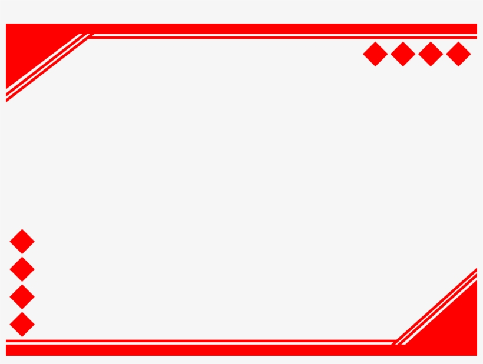

# Weather Tracking

## Description
- What was your motivation?
My motivation for writing this application was to design an app that helped track weather patterns.

- Why did you build this project?
I built it because I am regularly find that it is hard to determine the movement of weather.

- What problem does it solve?
My goal was to solve the weather tracking problem.

- What did you learn?
I learned that API calls from different weather data providers was slow, so I had to generate my own data.

## Table of Contents
- [Installation](#installation)
- [Usage](#usage)
- [Credits](#credits)
- [License](#license)
- [Badges](#badges)
- [Features](#features)
- [Contribute](#contribute)
- [Tests](#tests)
  
## Installation
1. Dowload from Github
2. Run weatherApp.py
  
## Usage
Usage: weatherAppy. -d <datafile>

## Screenshots
```md

```
```md

```

## Credits

### Collaborators
- John Salley <www.github.com/js>
- Bill Lambert <www.github.com/bl>
- Dennis Rodman <www.github.com/dr>

## Third-Party
- Apache
- Bulma

### Tutorials
- https://www.github.com/win-will/weatherApp
- https://www.github.com/win-will/weatherApp2

## License

### Apache License 2.0
[](https://choosealicense.com/licenses/apache-2.0/)

### GNU LGPLv3
[](https://choosealicense.com/licenses/lgpl-3.0/)

## Badges
- 

## Features
- Feature1
- Feature2

## How to Contribute
You can contribute by forking the project at github and sending pull requests for adding additional features.

## Tests
- Run npm test to execute all tests cases.